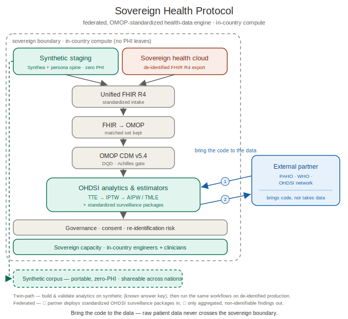

# Architecture — twin-path FHIR → OMOP for a Sovereign Learning Health System

This repository is the **synthetic staging path** of a two-path architecture. Both
paths run the *same* FHIR R4 → OMOP CDM v5.4 → OHDSI analytics logic; they differ only
in where the FHIR comes from and how completely the vocabulary is mapped. The synthetic
path exists so that every analytical package can be built and validated against a known
answer key **before** it is ever pointed at real patient data.

SHP is **health-system-agnostic**: the only hard requirement is a standard **FHIR R4
export**. Any system that can produce de-identified FHIR can drive the production path —
nothing here is tied to a specific vendor, cloud, or country.

<picture>
  <source media="(prefers-color-scheme: dark)" srcset="data-flow-dark.svg">
  
</picture>

*Federated data-flow (theme-aware; renders from `data-flow.svg` / `data-flow-dark.svg` in
this folder). The ASCII below is the text-only equivalent.*

```
                         ┌──────────────────────── SAME LOGIC ────────────────────────┐
                         │                                                            │
 SYNTHETIC (this repo)   │   Synthea + Nemotron personas ─► FHIR R4 + CSV ─►          │
                         │        FHIR/CSV → OMOP CDM v5.4 (DuckDB) ─► OHDSI estimators│
                         │                                                            │
 PRODUCTION (future)     │   Google Cloud Healthcare API (de-identified FHIR export)  │
                         │        ─► BigQuery ─► FHIR→OMOP ─► OMOP CDM (BigQuery)      │
                         │        ─► same OHDSI estimators, run in-country            │
                         └────────────────────────────────────────────────────────────┘
                                   ▲                              ▲
                            Athena vocabulary            only aggregate, non-identifiable
                        (ICD-11→SNOMED, LOINC, RxNorm)     results cross the border
```

The synthetic corpus is the **one artifact that crosses the sovereign boundary** (it
contains zero PHI) and is regionally exportable as sovereign deployments expand across Central/South
America. Real, patient-level records never leave national infrastructure; only the
validated analytical *packages* travel in, and only aggregate *findings* travel out.

---

## Current vs. target

| Concern | Synthetic staging path (today, this repo) | Production path (target) |
|---|---|---|
| **FHIR source** | Synthea R4 bundles from Nemotron-calibrated SV personas | De-identified R4 export from the **Google Cloud Healthcare API** |
| **Landing zone** | Local files → DuckDB (single file, offline) | Google Cloud Storage / **BigQuery** |
| **FHIR→OMOP** | Lightweight DuckDB ETL over Synthea's flat CSV | **OMOP-on-FHIR** or Google **Healthcare Data Harmonization (Whistle)** mapping, or BigQuery FHIR→OMOP reference pipelines |
| **Vocabulary** | Starter layer: validated crosswalk for known codes, rest `concept_id=0` (measured) | Full **OHDSI Athena** build |
| **Diagnoses** | SNOMED source codes (Synthea-native) | **ICD-11 → SNOMED** (production feeds may emit ICD-11 — see the bridge below) |
| **Labs / Drugs** | LOINC / RxNorm source codes | LOINC / RxNorm + ATC, Athena-mapped |
| **Query strategy** | `*_source_value` for unmapped codes; `concept_id` where mapped | Standard `concept_id` throughout |
| **Analytics** | naive → IPTW → AIPW → TMLE, validated on a known ATE | OHDSI **CohortMethod / CohortDiagnostics / MethodEvaluation** |
| **Engine** | DuckDB (portable, Athena-free) | BigQuery + OHDSI stack (Postgres/Spark for WebAPI/Atlas) |

The DDL and record shapes are spec-conformant OMOP CDM v5.4, so records built on the
synthetic path port to the production CDM unchanged.

---

## The vocabulary-mapping seam

> **A full OHDSI Athena vocabulary build is a *required* step for production — it is not
> optional.** This repository is a **proof of concept**: it *simulates* that step with a
> small validated crosswalk so the pipeline runs end-to-end and the mapped-`concept_id`
> pattern is demonstrable, offline and in Colab. It does **not** claim to be a complete
> vocabulary mapping. A full Athena build is licence-gated (SNOMED, etc.) and multi-GB, so
> it cannot ship in a git repo or a Colab notebook — completeness is inherently a
> production property, delivered on the real-world path below.

The synthetic path deliberately does **not** fully solve vocabulary mapping. Instead of
hiding that, the repo makes it a *measured* number and a clean seam, so the simulation is
honest and the path to the real build is a drop-in:

1. **Starter vocabulary layer** (`scripts/shp/omop/vocabulary.py`) seeds a curated
   concept set with real standard `concept_id`s where we are confident.
2. **Starter crosswalk** (`reference/vocab/starter_crosswalk.csv`) maps the source codes
   we have validated (Type 2 diabetes `SNOMED 44054006` → `201826`; HbA1c
   `LOINC 4548-4` → `3004410`) and lists the remaining high-value SV codes (eGFR, CKD
   stages, dengue, hypertension, key drugs) as explicit `todo-athena` rows with
   `standard_concept_id = 0` — honestly unmapped rather than guessed.
3. **The ETL applies it and the quality gate measures it:**
   ```bash
   shp etl                # baseline: everything *_concept_id = 0
   shp etl --vocab        # apply the starter crosswalk
   # → measurement standard-mapped coverage climbs off zero (HbA1c rows now map to 3004410)
   ```

**To move toward production**, extend the crosswalk from an Athena/Usagi mapping pass (or
replace the whole stage with OMOP-on-FHIR / ETL-Synthea, which write the same CDM with
full vocabulary). Nothing downstream changes — the estimators read the same tables.

### The ICD-11 → SNOMED bridge (production only)

A production FHIR feed may code diagnoses in **ICD-11**, which has **no mature standard
OMOP/SNOMED map** — this is the known weak spot. The production path
bridges it via **ICD-10 → SNOMED** (well-established in Athena) with a **Usagi / Source-to-
Concept-Map (STCM)** pass for the ICD-11-specific and locally-important codes (e.g.
Mesoamerican nephropathy / CKDu, which lacks a clean SNOMED concept). This does **not**
apply to the synthetic path — Synthea already emits SNOMED/LOINC/RxNorm — so it lives
here as design, not code.

> Note on tooling: an earlier handoff referenced a "Whale engine." The actual OHDSI /
> Google components are **OMOP-on-FHIR**, Google **Healthcare Data Harmonization (Whistle)**,
> **ETL-Synthea**, and **Usagi/Athena** for vocabulary. Named here to avoid confusion.

---

## What is real today vs. designed

- **Real and running:** the full synthetic path — generation, FHIR+CSV, DuckDB OMOP ETL,
  the quality gate, the four estimators validated on an injected ATE, the vocabulary seam,
  and the two Colab notebooks.
- **Designed, not built here:** the GCP Healthcare API de-id export, BigQuery landing,
  OMOP-on-FHIR/Whistle mapping, the full Athena build, the ICD-11→SNOMED bridge, and the
  OHDSI CohortMethod analytics. These are the production path this staging environment
  is built to de-risk.

Everything in this repository is synthetic and contains zero PHI. Synthetic ≠ evidence:
the estimators recover the structure we inject; they make no epidemiological claim.
